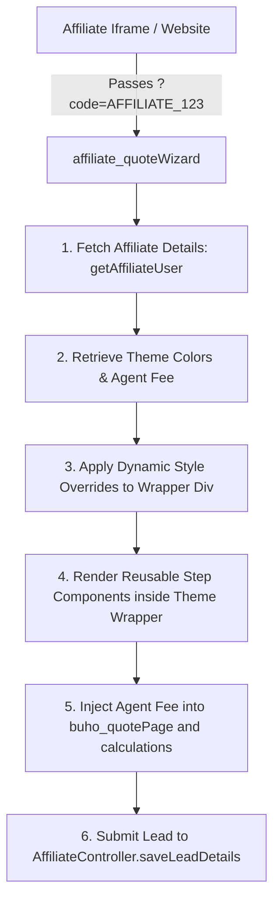

# Revamping the Affiliate Policy Creation Portal with Buho Design System

## 1. Executive Summary

This proposal outlines the strategy for revamping the Mex-Insurance **Affiliate Policy Creation Portal**. Currently, affiliates utilize the `affiliateQuickPolicy` component, which is a legacy, monolithic LWC styled using standard Salesforce Lightning Design System (SLDS). It presents an outdated user experience that lacks visual appeal and modularity.

In contrast, our recently developed customer portal features a premium, responsive **Wizard-based UI** (`buho_quoteWizard`) styled with the sleek **Buho Design System** (`buhoStyles.css`). Since the core policy creation steps, data models, and integration logic are **95% identical** between the two portals, we have a unique opportunity to build a modern, high-converting, and easily maintainable affiliate portal by leveraging these new components.

To keep the affiliate experience separated, modular, and customizable, we will implement **Option B: Isolated Wizard Shell (`affiliate_quoteWizard`)**. This container will manage page transitions, state updates, custom pricing (agent fees), and dynamic CSS theme overrides tailored for white-label iframe integrations on partner websites.

---

## 2. Component Analysis: Old vs. New

### A. The Legacy Monolithic Component (`affiliateQuickPolicy`)
* **File Size & Structure**: A single massive LWC consisting of a **~3,300 line HTML template** and a **~3,900 line JavaScript controller**.
* **Visual Presentation**: Uses heavy `lightning-accordion-section` wrappers and grey form cards. It feels crowded, dated, and lacks transition animations.
* **Input Elements**: Relies entirely on native `<lightning-input>` and `<lightning-combobox>` which conflict with modern, custom-branded landing pages.
* **Maintainability**: Low. Any tweak to vehicle details, driver details, or payment logic requires editing a 7,000-line codebase.

### B. The Modern Buho Wizard (`buho_quoteWizard` & Step Components)
* **File Size & Structure**: Highly modular. The main container is under **100 lines of HTML** and **750 lines of JavaScript**.
* **Dynamic Rendering**: Uses LWC's dynamic component loading (`lwc:component lwc:is={componentConstructor}`) to transition seamlessly between steps.
* **Visual Presentation**: Implements the Buho Design System with smooth CSS animations, glassmorphism, responsive Bootstrap grid layouts, custom SVG icons, and consistent spacing.
* **Reusability**: Uses a set of dedicated, single-purpose child components:
  1. `c-buho_userDetails`
  2. `c-buho_vehicleDetails`
  3. `c-buho_termOption`
  4. `c-buho_territory`
  5. `c-buho_quotePage`
  6. `c-buho_towDetails`
  7. `c-buho_finalizeVehicleDetails`
  8. `c-buho_lienholderInformation`
  9. `c-buho_driverDetails`
  10. `c-buho_ownerDetails`
  11. `c-buho_finalDetails`
  12. `c-buho_payment`
  13. `c-buho_confirmation`
  14. `c-buho_feedback`
* **Core Utilities**: Standardized state management via `c-buho_utils`, transforming unstructured wizard steps into clean payload formats using `createTransformedData` and `getCustomerRecord`.

---

## 3. Core Differences & Integration Points

| Feature | Legacy Affiliate Portal (`affiliateQuickPolicy`) | Modern Customer Portal (`buho_quoteWizard`) |
| :--- | :--- | :--- |
| **Authentication** | Direct public access via affiliate URL parameter (No login). | Direct public access (No login required for guest quote). |
| **Affiliate Tracking** | Parses `?code=AFFILIATE_ID` to fetch agent fees, owner photos, and branding from the `Affiliate__c` custom object. | Standard direct customer quote. Uses default brand settings. |
| **Apex Controller** | Uses `AffiliateController` for retrieving affiliate metadata and `saveLeadDetails()` for upserting records. | Uses `CustomerQuoteFlow` and `NcExistingCustomerFlow` for lead creation and customer retrieval. |
| **UI Structure** | Accordions on a single page. | Multi-step interactive Wizard with dynamic state preservation in the URL. |
| **Data Fields** | Same: First Name, Last Name, Email, Phone, Vehicle Specs, Coverage Options, Driver/Owner Details, Payment Info. | Same: Maps exactly to the fields parsed by `c-buho_utils`. |

---

## 4. Architectural Design: Isolated Affiliate Wizard (`affiliate_quoteWizard`)

The isolated wizard shell duplicates the container pattern of `buho_quoteWizard` to maintain complete separation of customer and partner portals. It loads the exact same reusable step LWCs but adapts the header branding, pricing logic (agent fees), and CSS variables at the parent container level.



### A. Dynamic Theme Styling & CSS Variable Overrides
The styling for the portal resides in the unified stylesheet `buhoStyles.css`. By default, custom elements are styled using root variables:
```css
:root {
    --primary-blue: #13203D;
    --buho-primary-blue: #13203D;
    --accent-pink: #E53C7B;
    --buho-accent-pink: #E53C7B;
    --light-blue: #89DBEF;
    --buho-light-blue: #89DBEF;
}
```

Since affiliates embed the portal via iFrames, we will override these CSS variables dynamically on the parent container element (`div.theme-wrapper`) based on parameters configured on their `Affiliate__c` record.

#### Default Neutral Theme
If no theme colors are configured for the affiliate, the portal defaults to a **neutral palette** that fits seamlessly inside any partner website:
* **Primary Color (`--primary-blue` / `--buho-primary-blue`)**: `#1E293B` (Slate Gray)
* **Accent Color (`--accent-pink` / `--buho-accent-pink`)**: `#475569` (Slate Accent)
* **Light Color (`--light-blue` / `--buho-light-blue`)**: `#E2E8F0` (Light Slate Border/Background)

---

## 5. Implementation Blueprint

### Step 1: Database Setup
Create three new custom fields on the `Affiliate__c` object to hold hexadecimal color strings:
1. `Theme_Primary_Color__c` (Text, 7 characters, e.g., `#1A365D`)
2. `Theme_Accent_Color__c` (Text, 7 characters, e.g., `#2B6CB0`)
3. `Theme_Light_Color__c` (Text, 7 characters, e.g., `#EBF8FF`)

Add these fields to the query inside `AffiliateController.cls`:
```apex
List<Affiliate__c> affiliateUserList = [SELECT Affiliate_Id__c, Agency_Logo__c, 
                                                Agent_Id__c, Agent_Contact__c,
                                                Agent_Fee__c, Agency_Id__c, 
                                                Owner_Name__c, Owner_Photo__c,
                                                Theme_Primary_Color__c,
                                                Theme_Accent_Color__c,
                                                Theme_Light_Color__c
                                         FROM Affiliate__c WHERE Affiliate_Id__c = :affiliateId];
```

### Step 2: HTML Template Wrapper (`affiliate_quoteWizard.html`)
Wrap all child wizard components in a container element styled dynamically by LWC:
```html
<template>
    <div class="theme-wrapper" style={dynamicStyle}>
        <!-- Custom Partner Header -->
        <template if:true={displayHeader}>
            <header class="wizard-header glass-card">
                <div class="container-fluid px-4 py-3 d-flex justify-content-between align-items-center">
                    <div class="partner-branding d-flex align-items-center">
                        <template if:true={agencyLogo}>
                            
                        </template>
                        <div>
                            <h3 class="agent-title mb-0">{ownerName}</h3>
                            <span class="badge">Partner portal</span>
                        </div>
                    </div>
                    <button class="btn btn-contact" onclick={handleContactClick}>Contact Us</button>
                </div>
            </header>
        </template>

        <!-- Stepper Navigation & Reusable Components -->
        <main class="wizard-main">
            <div class="wizard-container">
                <template if:true={showProgressBar}>
                    <c-buho_progress-bar
                        current-step={currentStep}
                        total-steps={totalSteps}
                        hide-back-button={isFirstStep}
                        onback={handleNavigation}>
                    </c-buho_progress-bar>
                </template>

                <c-buho_toast></c-buho_toast>

                <div class="wizard-steps">
                    <template if:true={componentConstructor}>
                        <lwc:component 
                            lwc:is={componentConstructor} 
                            payload={payload}
                            onpayloadupdate={handlePayloadUpdate}
                            onfullpayloadupdate={handlePayloadUpdateComplete}
                            onchangescreen={handleNavigation}
                            onloadingstatuschange={handleLoadingStatus}
                            ontoastevent={handleToastEvent}
                            onstepchange={handleStepChange}
                            total-steps={totalSteps}
                            >
                        </lwc:component>
                    </template>
                </div>
            </div>
        </main>
    </div>
</template>
```

### Step 3: Dynamic CSS Override Controller (`affiliate_quoteWizard.js`)
Retrieve the custom colors from the `Affiliate__c` profile and build the dynamic styles:
```javascript
import { LightningElement, track, wire } from 'lwc';
import { CurrentPageReference } from 'lightning/navigation';
import getAffiliateUser from '@salesforce/apex/AffiliateController.getAffiliateUser';
import saveLeadDetails from '@salesforce/apex/AffiliateController.saveLeadDetails';

export default class Affiliate_quoteWizard extends LightningElement {
    @track currentStep = 1;
    @track payload = [];
    @track affiliateBranding = {};
    affiliateCode;

    @wire(CurrentPageReference)
    getPageReferenceParameters(currentPageReference) {
        if (currentPageReference && currentPageReference.state.code) {
            this.affiliateCode = currentPageReference.state.code;
            this.fetchAffiliateDetails();
        }
    }

    async fetchAffiliateDetails() {
        try {
            const data = await getAffiliateUser({ affiliateId: this.affiliateCode });
            this.affiliateBranding = JSON.parse(data);
            this.injectAffiliateMetadata();
        } catch (error) {
            console.error('Error fetching affiliate details:', error);
        }
    }

    // Dynamic Styling computed getter to inject CSS variables
    get dynamicStyle() {
        // Fall back to slate neutral colors if affiliate fields are empty
        const primary = this.affiliateBranding?.Theme_Primary_Color__c || '#1E293B';
        const accent = this.affiliateBranding?.Theme_Accent_Color__c || '#475569';
        const light = this.affiliateBranding?.Theme_Light_Color__c || '#E2E8F0';

        return `
            --primary-blue: ${primary};
            --buho-primary-blue: ${primary};
            --accent-pink: ${accent};
            --buho-accent-pink: ${accent};
            --light-blue: ${light};
            --buho-light-blue: ${light};
        `;
    }

    injectAffiliateMetadata() {
        let newPayload = [...this.payload];
        const agentFee = parseFloat(this.affiliateBranding?.Agent_Fee__c || 0);

        const quoteIndex = newPayload.findIndex(item => item.quotePage);
        const affiliateData = {
            affiliateCode: this.affiliateCode,
            agentFee: agentFee,
            agencyId: this.affiliateBranding?.Agency_Id__c,
            agentId: this.affiliateBranding?.Agent_Id__c
        };

        if (quoteIndex >= 0) {
            newPayload[quoteIndex].quotePage.affiliate = affiliateData;
        } else {
            newPayload.push({ quotePage: { affiliate: affiliateData } });
        }
        this.payload = newPayload;
    }

    async handleQuoteSubmission() {
        // Build Lead JSON payload and save
        const customerRecord = this.getCustomerRecordFromPayload();
        
        await saveLeadDetails({
            leadJson: JSON.stringify({
                FirstName: customerRecord.FirstName,
                LastName: customerRecord.LastName,
                Email: customerRecord.Email,
                Phone: customerRecord.Phone,
                Policy_Type__c: customerRecord.policyType
            }),
            quoteJSON: JSON.stringify(customerRecord.quoteRecord),
            vehicleJSON: JSON.stringify(customerRecord.vehicleData),
            towedlistJSON: JSON.stringify(customerRecord.vehicleData.towunits),
            affiliateCode: this.affiliateCode
        });
    }
}
```

### Step 4: Integrate Agent Fee inside `buho_quotePage.js`
Modify the shared `buho_quotePage.js` component to dynamically load and display pricing calculations inclusive of the `agentFee` retrieved from the payload:

```javascript
// 1. Add getter in buho_quotePage.js to pull fee from payload
get agentFee() {
    const quotePageObj = this.payload?.find(item => item.hasOwnProperty('quotePage'))?.quotePage;
    return parseFloat(quotePageObj?.affiliate?.agentFee || 0);
}

// 2. Add fee directly to total display options in getQuote()
const total = {
    ...
    total: (parseFloat(companyData.Total) + this.agentFee).toFixed(2),
    ...
}
```

---

## 6. Expected UI Improvements

1. **White-Label Compatibility**: The dynamic theme injection allows partner insurance brokers to load our widget within their sites (using IFrames) and seamlessly match their own branding guidelines.
2. **Neutral Default Presentation**: Out-of-the-box gray-slate gradients present a highly clean, neutral layout that will not clash with any hosting website.
3. **No Code Duplication in Step Logic**: Reusable steps inherit custom properties automatically. 100% style updates cascade through LWC's shadow root boundary.
